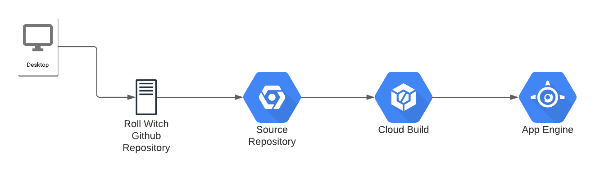
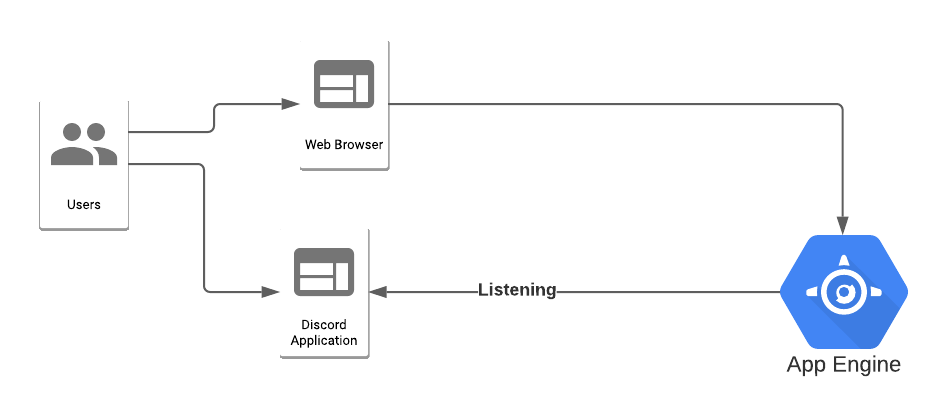

# Roll Witch
Roll witch is a discord dice bot written in python.

Currently this support regex and token based input parsing.

## Application

The application folder structure:

| Folder | |
|--------|---------|
|.github| Github Actions definition for linting|
|app.yaml| App engine definition used in deployment|
|cloudbuild.yaml| Google cloud build used for ci/cd|
|Tests | Unit tests|
|roll_witch| project module|
|roll_witch.dice_bot| Code for the dice bot|
|roll_witch.web_app| Code for the Web app part of roll witch GM tools etc|

This application is created using a asynchronous non blocking approach.

## Libraries:
This project uses the following libraries.

 | Library | What | Why |
 |---------|-------|-----|
 | Asyncio | Async library for python | its one of the better libraries and allowed both the discord and the web app to share a environment |
 |discord.py | python discord bot library | Best document discord bot library|
 |hypothesis| A property based testing library for python| Allows fuzzing and advanced testing approaches|
 
## Infrastructure
This application is using Google App Engine.
### Commit Flow

This application is held in Github.
Google cloud has a read only replica of the application repository for trigger purposes.
A trigger exists which will run the cloud build definition in this project on google cloud build.
The cloud build file defines the app engine deployment.
No infrastructure is manually configured and this can be replicated on other acocunts by adding the cloud build deployment there.

When committing a developer will do the following:
1. Code is Commited to Git and pushed to Github on a branch
2. A pull request is raised on github
3. Github will run the action on the pull request to confirm linting and tests pass
4. Pull request is merged

Changes to master will cause the following to happen for a deployment
1. The Github action will stard to validate master.
2. The Source repository in google cloud will detect a change and trigger cloud build.
3. Cloud build will test and deploy the project to app engine
4. App engine will startup the new application version 
5. App engine will check the application is responding to web requests
6. The old version is torn down.

### Data Flow
The application consists of 2 parts a dice bot and a web application.
Due to limitations of the app engine the web app has been created as a placeholder for now.

Users can post discord messages to a server that has rollwitch enrolled.
- Roll witch will listen to messages
- if they start with a set instruction it will parse the message
- once parsed it will process the message and respond to discord.

In addition once the web app is completed it will have a web url that can respond directly to the user via their web browser.

